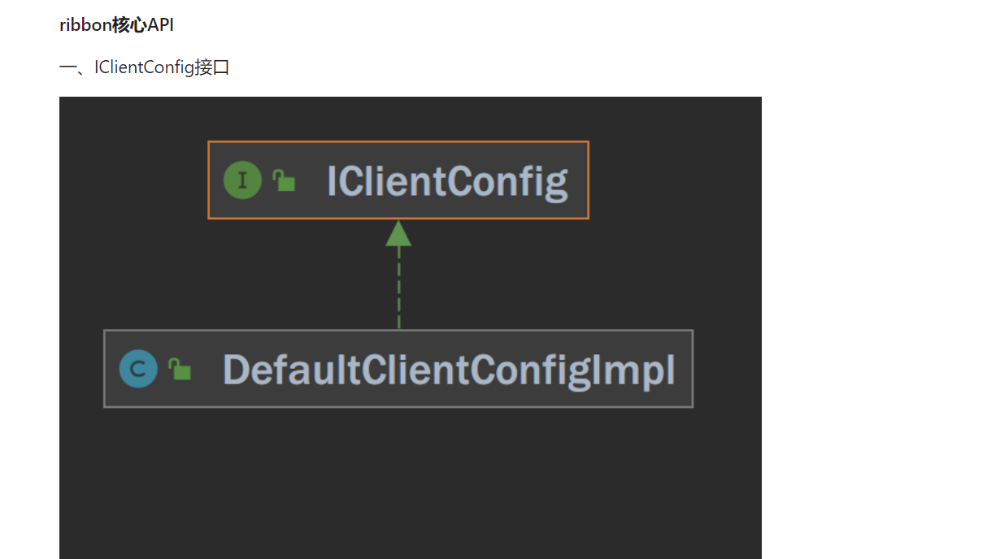
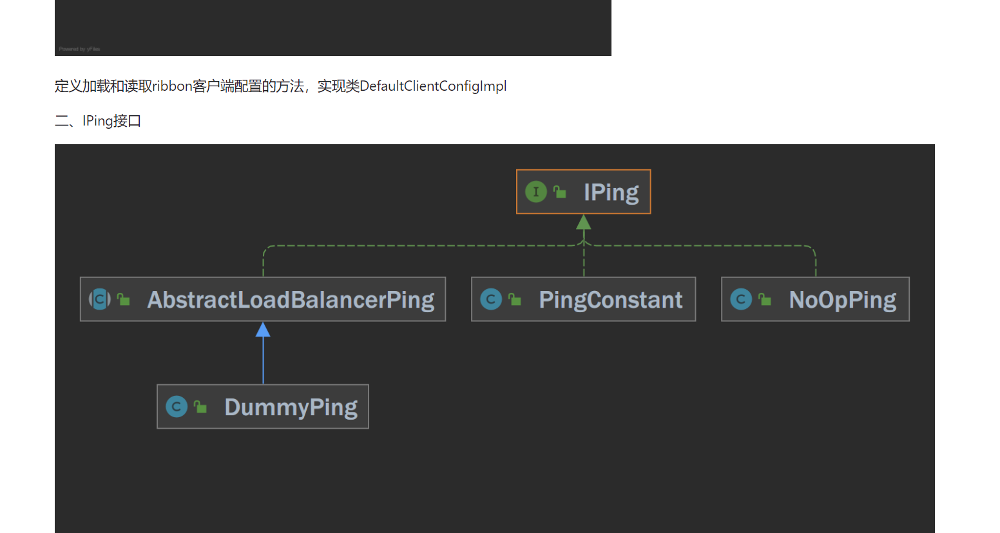
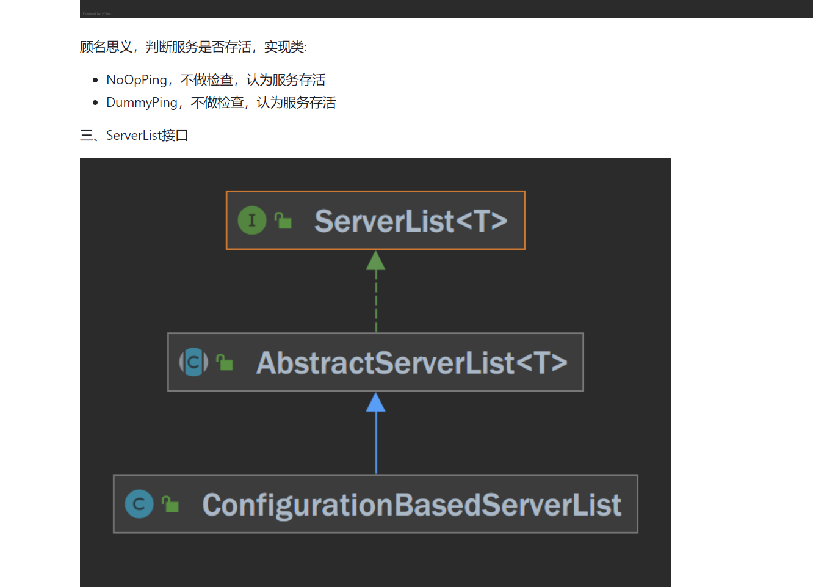
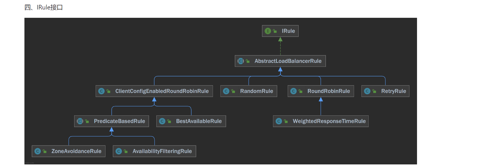
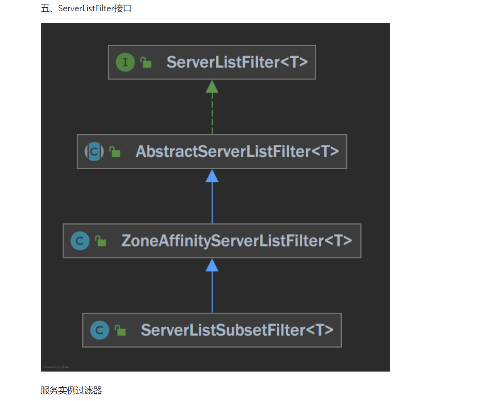
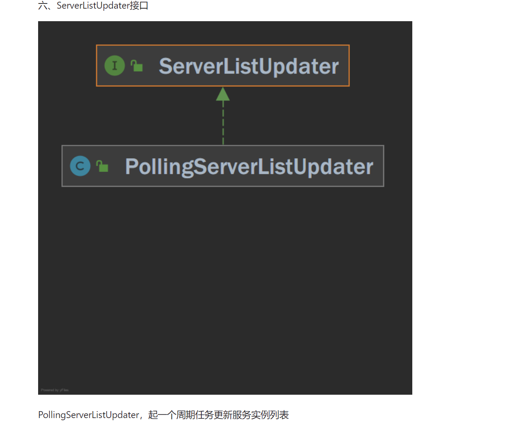
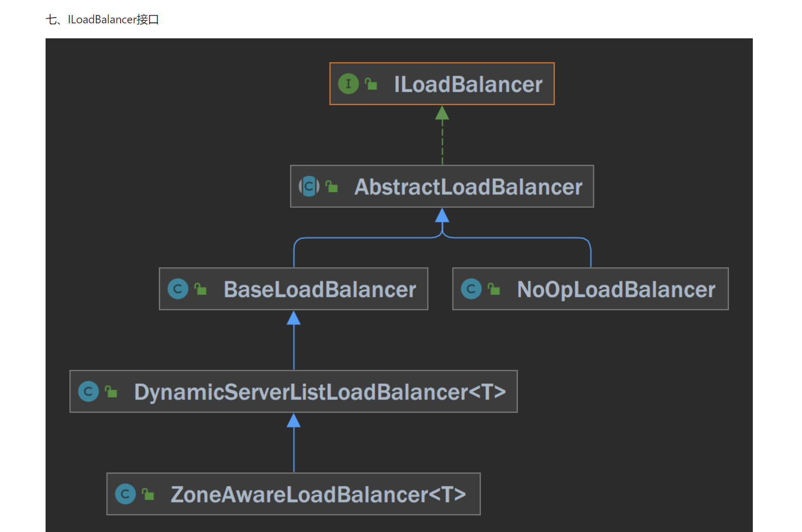
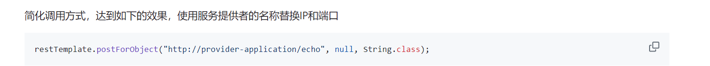
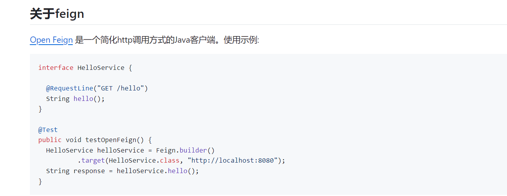

1、服务注册
  1、1服务注册功能实现
    自动装配TutuServiceRegistryAutoConfiguration
2、服务发现
    自动装配TutuDiscoveryAutoConfiguration
3、集成ribbon实现客户端负载均衡
   3.1 ribbon是一个提供如下功能的依赖包:
    负载均衡、
    容错机制、
    支持多种协议(HTTP, TCP, UDP)，支持异步和响应式的调用方式
    缓存和批处理
、、、
、、
   3.2 集成ribbon实现客户端负载均衡(二)

4.集成Feign简化调用方式
     
     4.1、Contract接口 负责解析Feign客户端接口的类注解、方法注解和参数。
       实现类feign.Contract.Default支持Open Feign的注解，比如上面第一个示例中的RequestLine注解。
       Spring Cloud OpenFeign开发的实现类SpringMvcContract支持Spring MVC的注解，如GetMapping、PostMapping、RequestMapping。
    4.2、Encoder接口
        编码器，将请求对象编码为请求体
    4.3、Decoder接口
        解码器，将响应体解码为对象
    4.4、RequestInterceptor拦截器接口
    4.5、Client接口
        提交http请求的接口
5.API 网关 Netflix Zuul是一个提供动态路由、监控、弹性容量、安全等功能的基于第七层网络协议的应用程序网关。
      Zuul测试还没完成
